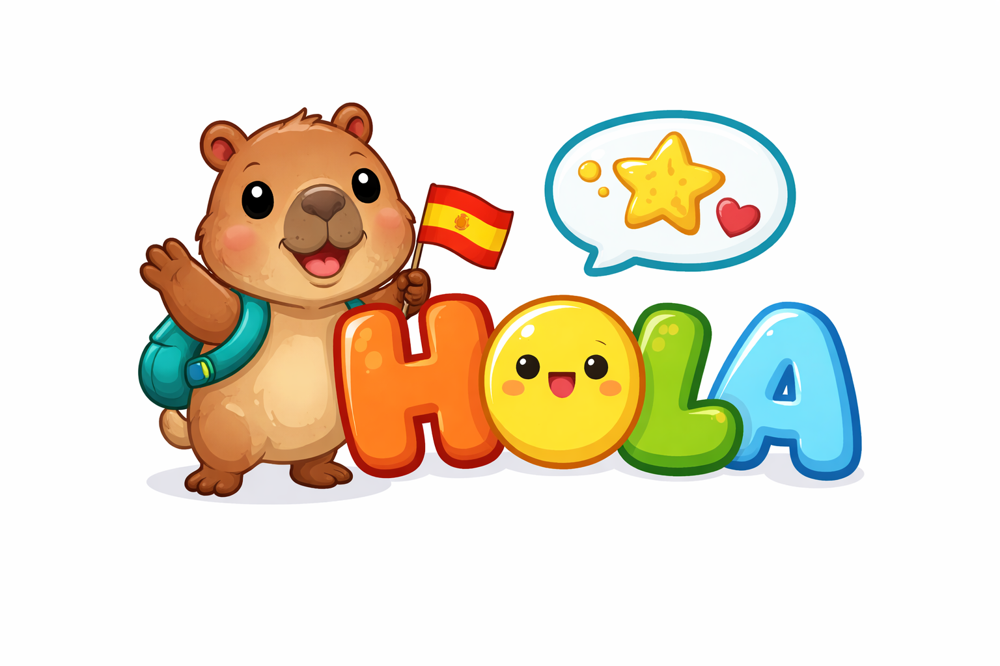

<p align="center">
  
</p>

<h1 align="center">Hola - Plataforma Infantil de Espanhol</h1>

<p align="center">
  <strong>Uma plataforma educacional inovadora para ensino de espanhol para crianças de 6 a 12 anos</strong>
</p>

<p align="center">
  
  
  
  
  
</p>

---

## Princípio Central

> **A criança precisa amar usar.**
> **O adulto precisa confiar para pagar.**

---

## Sobre o Projeto

O **Hola** é uma plataforma de ensino de espanhol desenvolvida especificamente para crianças brasileiras de 6 a 12 anos. Diferente de outras plataformas que adaptam conteúdo adulto para crianças, o Hola foi projetado desde o início pensando nas necessidades, interesses e formas de aprendizado infantil.

### Por que o Hola é diferente?

| Característica | Hola | Concorrentes |
|----------------|------|--------------|
| **Público** | 100% infantil desde a concepção | Adaptação de conteúdo adulto |
| **Metodologia** | Narrativa + afeto + repetição | Gamificação pura |
| **Idioma** | Espanhol nativo para brasileiros | Tradução genérica |
| **Cultura** | Latino-americana integrada | Genérica/global |
| **Currículo** | Alinhado à BNCC | Não aplicável |
| **Relatórios** | Progresso claro para pais | Básico ou inexistente |

---

## Problema de Mercado

### Problemas que resolvemos:

| Problema | Nossa Solução |
|----------|---------------|
| Plataformas genéricas não pensadas para crianças | Produto 100% infantil com personagens e histórias |
| Aprendizado fragmentado (vocabulário solto) | Trilhas de aprendizagem com progressão clara |
| Falta de prova de progresso para os pais | Relatórios simples e visuais |
| Baixa retenção infantil | Aulas curtas (5min), narrativa envolvente |
| Métodos frios, pouco afetivos | Personagem guia, celebração de conquistas |
| Custo alto de aulas ao vivo | Assinatura acessível |
| Riscos de segurança | Ambiente fechado, sem chat, sem anúncios |

---

## Público-Alvo

### Usuário Final: Crianças
- **Idade:** 6 a 12 anos
- **Perfil:** Nativos digitais, preferem conteúdo visual e interativo
- **Motivação:** Aprendizado divertido com recompensas

### Comprador: Pais e Responsáveis
- **Perfil:** Classe B/C+, valorizam educação
- **Motivação:** Investir no futuro dos filhos com bilinguismo
- **Necessidade:** Saber que o filho está aprendendo de verdade

### Comprador B2B: Escolas
- **Perfil:** Escolas particulares de Ensino Fundamental
- **Motivação:** Oferecer espanhol alinhado à BNCC
- **Necessidade:** Relatórios de turma, suporte pedagógico

---

## Estrutura do Produto

O Hola é organizado em 3 níveis progressivos:

```
┌─────────────────────────────────────────────────────────────────┐
│                                                                 │
│   NÍVEL 1: EXPLORAR (MVP)                                      │
│   ━━━━━━━━━━━━━━━━━━━━━━━                                      │
│   Objetivo: Familiaridade com espanhol de forma natural        │
│   Conteúdo: Sons, palavras básicas, jogos simples              │
│   Formato: 5-8 aulas, 1 tema (animais), 1 personagem           │
│                                                                 │
├─────────────────────────────────────────────────────────────────┤
│                                                                 │
│   NÍVEL 2: CONECTAR (Futuro)                                   │
│   ━━━━━━━━━━━━━━━━━━━━━━━━                                     │
│   Objetivo: Compreensão e uso inicial do idioma                │
│   Conteúdo: Frases curtas, comandos, histórias guiadas         │
│   Formato: Assinatura mensal, novos temas mensais              │
│                                                                 │
├─────────────────────────────────────────────────────────────────┤
│                                                                 │
│   NÍVEL 3: EXPRESSAR (Futuro)                                  │
│   ━━━━━━━━━━━━━━━━━━━━━━━━━                                    │
│   Objetivo: Uso funcional do espanhol em contexto              │
│   Conteúdo: Situações reais, produção oral, criatividade       │
│   Formato: Licença escolar, alinhado à BNCC                    │
│                                                                 │
└─────────────────────────────────────────────────────────────────┘
```

---

## Conteúdo do MVP

### Trilha dos Animais (5 aulas)

| Aula | Tema | Palavras |
|------|------|----------|
| 1 | Animais da Fazenda | perro, gato, vaca, caballo, pollo |
| 2 | Animais Selvagens | león, elefante, mono, jirafa, tigre |
| 3 | Animais do Mar | pez, ballena, delfín, tiburón, tortuga |
| 4 | Pequenos Animais | mariposa, abeja, hormiga, araña, caracol |
| 5 | Revisão Final | Todos os anteriores |

### Estrutura de Cada Aula (~5 minutos)

```
┌──────────────────────────────────────────┐
│  1. INTRODUÇÃO (30s)                     │
│     Personagem guia apresenta o tema     │
├──────────────────────────────────────────┤
│  2. VOCABULÁRIO (2min)                   │
│     Imagem + Áudio + Palavra             │
│     Toque para ouvir e repetir           │
├──────────────────────────────────────────┤
│  3. QUIZ INTERATIVO (1.5min)             │
│     Associar imagem à palavra            │
│     Feedback positivo imediato           │
├──────────────────────────────────────────┤
│  4. CELEBRAÇÃO (30s)                     │
│     Estrelas conquistadas                │
│     Animação de parabéns                 │
└──────────────────────────────────────────┘
```

---

## Funcionalidades

### Para a Criança
- Acesso simples sem cadastro complexo
- Personagem guia fixo e carismático
- Trilhas de aprendizagem com progressão visual
- Aulas curtas e dinâmicas (~5 minutos)
- Interação constante (tocar, ouvir, repetir)
- Sistema de recompensas (estrelas)
- Feedback positivo em todas as ações

### Para os Pais
- Painel de acompanhamento protegido por PIN
- Visualização de aulas completadas
- Lista de palavras aprendidas
- Tempo total de uso
- Progresso percentual

### Para Escolas (Futuro)
- Painel administrativo de turmas
- Relatórios por aluno
- Conteúdo alinhado à BNCC
- Guia para professores
- Licenciamento por aluno

---

## O Que as Crianças Gostam (Incorporado ao Produto)

| Elemento | Como Implementamos |
|----------|-------------------|
| Personagens recorrentes | Guia fixo em todas as aulas |
| Histórias contínuas | Trilha com narrativa progressiva |
| Jogos simples | Quiz de associação imagem-palavra |
| Repetição previsível | Estrutura de aula consistente |
| Reconhecimento visual | Estrelas, celebrações, progresso |
| Fazer, não apenas assistir | Tocar, ouvir, repetir, escolher |

---

## Tech Stack

| Camada | Tecnologia | Versão |
|--------|------------|--------|
| Frontend | React | 18.x |
| Linguagem | TypeScript | 5.x |
| Bundler | Vite | 5.x |
| Styling | Tailwind CSS | 3.x |
| Animações | Framer Motion | 11.x |
| Estado | Zustand | 4.x |
| Roteamento | React Router | 6.x |
| Backend (futuro) | Supabase | - |
| Database (futuro) | PostgreSQL | 15.x |

---

## Estrutura do Projeto

```
hola/
├── public/
│   └── images/
│       └── logo-hola.png          # Logo do projeto
├── src/
│   ├── pages/
│   │   ├── Home/                  # Tela inicial
│   │   ├── Trail/                 # Trilha de aprendizagem
│   │   ├── Lesson/                # Aulas interativas
│   │   └── Parent/                # Painel dos pais
│   ├── stores/
│   │   └── userStore.ts           # Estado global (Zustand)
│   ├── hooks/
│   │   └── useAudio.ts            # Hook de áudio
│   ├── content/
│   │   └── lessons/               # Conteúdo das 5 aulas
│   ├── styles/
│   │   └── globals.css            # Estilos Tailwind
│   └── utils/
│       └── cn.ts                  # Utilitários
├── docs/
│   ├── prd/                       # Product Requirements
│   ├── architecture/              # Arquitetura técnica
│   └── business-analysis.md       # Análise de mercado
└── doc/
    └── relatorio_do_projeto*.md   # Documento original
```

---

## Começando

### Pré-requisitos

- Node.js 18+
- npm ou yarn

### Instalação

```bash
# Clonar repositório
git clone git@github.com:inematds/hola.git
cd hola

# Instalar dependências
npm install

# Iniciar servidor de desenvolvimento
npm run dev
```

### Scripts Disponíveis

| Comando | Descrição |
|---------|-----------|
| `npm run dev` | Inicia servidor de desenvolvimento |
| `npm run build` | Compila para produção |
| `npm run preview` | Preview da build |
| `npm run lint` | Verifica código com ESLint |
| `npm run test` | Executa testes |

---

## Diferenciais Competitivos

| Diferencial | Descrição |
|-------------|-----------|
| **100% Infantil** | Não é adaptação de adulto |
| **Método Pedagógico** | Narrativa + afeto + repetição |
| **Experiência Guiada** | Personagem conduz toda a jornada |
| **IA Invisível** | Apoio sutil, não protagonista |
| **Relatórios Claros** | Pais acompanham progresso real |
| **Simplicidade** | Interface limpa, poucos botões |
| **Alinhamento BNCC** | Pronto para escolas brasileiras |

---

## Análise de Mercado

### Dados do Mercado EdTech Brasil

| Indicador | Valor |
|-----------|-------|
| Mercado 2024 | US$ 5,41 bilhões |
| Projeção 2033 | US$ 14,64 bilhões |
| Crescimento anual | 11,70% |
| EdTechs ativas | ~1.050 |
| Startups K-12 | 373 |

### Oportunidade Identificada

**Não existe líder no nicho de espanhol para crianças brasileiras.**

Os concorrentes globais (Duolingo, Lingokids, Dinolingo) não focam:
- No público brasileiro especificamente
- Na proximidade linguística português-espanhol
- No alinhamento com currículo brasileiro (BNCC)

---

## Roadmap

### Fase 1: MVP (Mês 1-2)
- [x] Definir método pedagógico
- [x] Criar estrutura do projeto
- [x] Implementar 5 aulas de animais
- [ ] Testar com 5-10 crianças

### Fase 2: Validação (Mês 2-3)
- [ ] Landing page de conversão
- [ ] Integração de pagamento
- [ ] 3 novos temas (Cores, Números, Família)
- [ ] Primeiras vendas

### Fase 3: Escala (Mês 3-4)
- [ ] Nível 2: Conectar
- [ ] App PWA para instalação
- [ ] Relatórios avançados
- [ ] Marketing orgânico

### Fase 4: Escolas (Mês 4-6)
- [ ] Versão B2B para escolas
- [ ] Painel do professor
- [ ] Alinhamento BNCC documentado
- [ ] 5 escolas piloto

---

## Riscos e Mitigações

| Risco | Mitigação |
|-------|-----------|
| Baixa retenção infantil | Aulas curtas + narrativa contínua |
| Desconfiança dos pais | Relatórios claros de progresso |
| Concorrência global | Foco no nicho brasileiro |
| CAC alto | Estratégia orgânica + referral |
| Churn | Renovação constante de conteúdo |

---

## Documentação

| Documento | Descrição |
|-----------|-----------|
| [Metodologia 5 Fases](docs/metodologia-5-fases.md) | Guia prático para criar qualquer projeto |
| [PRD](docs/prd/) | Product Requirements Document completo |
| [Arquitetura](docs/architecture/) | Decisões técnicas e padrões |
| [Análise de Negócio](docs/business-analysis.md) | SWOT, concorrentes, oportunidades |
| [Relatório Original](doc/) | Documento inicial do projeto |

---

## Métricas de Sucesso (MVP)

| Métrica | Meta |
|---------|------|
| Tempo médio de sessão | > 5 minutos |
| Taxa de retorno D7 | > 40% |
| Taxa de conclusão por aula | > 60% |
| NPS de pais | > 50 |
| Criança pede para continuar | Sim |

---

## Contribuindo

Este é um projeto privado. Para contribuir, entre em contato com a equipe.

## Licença

Proprietary - Todos os direitos reservados.

---

<p align="center">
  <strong>Frase-guia do projeto:</strong><br>
  <em>"Começar pequeno, ensinar bem, crescer com prova real."</em>
</p>

<p align="center">
  <sub>Desenvolvido com dedicação para as crianças brasileiras aprenderem espanhol brincando.</sub>
</p>
